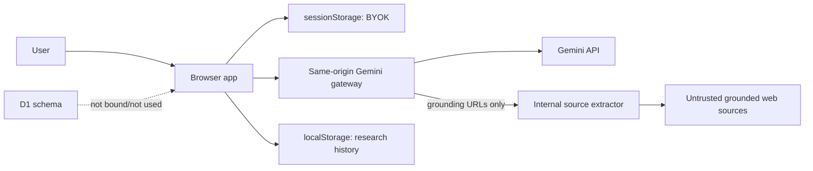

# Security and Trust

## 1. Trust boundaries

Public source text và model output đều là dữ liệu không đáng tin; không bên nào là ground truth.

## 2. Key handling

- Password field, cho phép hiện/ẩn/xóa.
- Lưu `sessionStorage`, không lưu local history hoặc D1.
- Gửi tới same-origin gateway bằng `x-gemini-api-key`; gateway đổi thành `x-goog-api-key` khi gọi upstream.
- Gateway có `no-store` response và không có code ghi key.

Rủi ro còn lại: XSS/extension/DevTools có thể đọc hoặc quan sát key; gateway chưa có vault, per-user identity, quota/rate limit hoặc abuse control. BYOK hiện tại phù hợp prototype, không phải kiến trúc secret production.

## 3. Source fetch/SSRF controls

Public arbitrary-fetch route đã bị loại bỏ. Browser không gửi URL trực tiếp cho extractor; Gemini gateway chỉ extract URL thu được từ grounding metadata của một search response thành công. Internal extractor hiện có:

- chỉ HTTP(S), cấm URL credentials;
- chặn localhost, private/reserved IPv4 literals và một số IPv6 private/reserved forms;
- manual redirect và validate lại từng destination;
- redirect, byte, excerpt và timeout limits;
- chỉ đọc content type text/HTML/JSON.

Việc bỏ public proxy giảm đáng kể bề mặt SSRF nhưng không chứng minh SSRF đã được giải quyết hoàn toàn: validation chưa resolve DNS để chặn hostname trỏ/rebind sang private IP, chưa có egress allow/deny policy ở network layer, chưa có rate limit/abuse control và chưa parse PDF/media. Cần DNS/IP verification hoặc isolated egress fetcher trước production.

## 4. Prompt injection và rendering

- Evidence packet JSON-encode toàn bộ source records bên trong `<UNTRUSTED_SOURCE_DATA_JSON>` để delimiter giả trong source không phá cấu trúc packet.
- Prompt nhắc model bỏ instruction nằm trong nguồn.
- Search chỉ được bật cho hai Scout; excerpt không thể tự cấp thêm tool.
- Markdown dùng `react-markdown`, GFM và `skipHtml`; không dùng raw HTML.
- Link nguồn mở với `noreferrer`.

Marker/prompt không loại bỏ hoàn toàn indirect prompt injection. Cần evaluation và policy enforcement độc lập với model.

## 5. Research integrity

- Nhiều URL không đồng nghĩa nhiều họ bằng chứng.
- Source-family live chỉ dựa trên exact signals; không nên gọi là provenance graph hoàn chỉnh.
- Warning quote phải dài tối thiểu 20 ký tự; claim/warning citation chỉ dùng exact substring không phân biệt hoa thường. Đây vẫn chỉ là lexical verification.
- Bias/framing không đồng nghĩa factual claim sai.
- Political disagreement không tự động là hostility/disinformation.
- Tất cả warnings live là `machine-only`; chưa có human approval.
- Claim citation có quote và character offset trong excerpt, nhưng chưa phải locator bền vững trong tài liệu gốc và chưa đủ cho quyết định high-stakes.

## 6. Privacy và persistence

Không nhập dữ liệu bí mật/nhạy cảm vào topic hoặc nguồn công khai. D1 schema đã tồn tại nhưng pipeline chưa ghi dữ liệu và hosting config có `d1: null`; lịch sử hiện nằm trong browser. Không có account isolation hoặc retention policy phía server vì chưa có server persistence.
