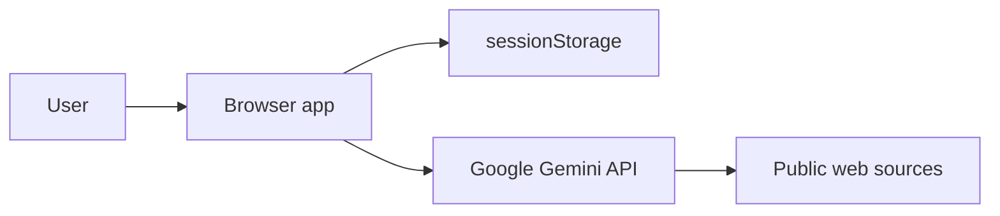

# Security and Trust

## 1. Trust boundaries

- Browser app được tin để xử lý key trong phiên.
- Public web source là dữ liệu không đáng tin cậy.
- Gemini output là nội dung cần kiểm tra, không phải ground truth.

## 2. API key handling hiện tại

- Nhập bằng password field.
- Có tùy chọn hiện/ẩn.
- Lưu trong `sessionStorage`, không phải `localStorage`.
- Gửi bằng `x-goog-api-key` header.
- Không render trong SSR.
- Không đưa vào URL, prompt, log hoặc report.
- Có hành động xóa key khỏi phiên.

### Rủi ro còn lại

- JavaScript/XSS trên cùng origin có thể đọc `sessionStorage`.
- Browser extension hoặc DevTools có thể quan sát request.
- Key BYOK không phù hợp cho public multi-user production app.
- Không có quota guard trong app.

Khuyến nghị: key thử nghiệm, giới hạn Generative Language API, quota thấp và không dùng quyền production rộng.

## 3. Prompt injection

Shared prompt yêu cầu bỏ qua instruction nằm trong nguồn web. Đây chỉ là một lớp phòng vệ.

Kiến trúc production nên:

- Tách fetch/extract khỏi reasoning.
- Sanitize và giới hạn content.
- Gắn nguồn và provenance trước khi đưa vào model.
- Không cho source text thay đổi tool permission hoặc system policy.
- Log nguồn gây nghi ngờ injection.

## 4. XSS và rendering

- Topic được React render như text.
- Gemini report dùng plain text + `white-space: pre-wrap`.
- Không dùng `dangerouslySetInnerHTML`.
- Link URL đến từ grounding metadata và mở bằng `noreferrer`.

Nếu thêm Markdown renderer, phải sanitize HTML và giới hạn protocol URL.

## 5. Research integrity

- Nhiều URL không đồng nghĩa nhiều bằng chứng độc lập.
- Bias không đồng nghĩa sai.
- Lỗi lập luận không tự động làm kết luận sai.
- Allegation phải giữ attribution.
- Không gắn political label chỉ từ một đoạn hoặc từ nhân thân.
- “Không tìm thấy bằng chứng” khác “đã chứng minh sai”.

## 6. Privacy

Không nên nhập:

- API key vào ô topic.
- Dữ liệu cá nhân nhạy cảm.
- Tài liệu bí mật hoặc nội bộ khi app còn gọi API công khai trực tiếp.

