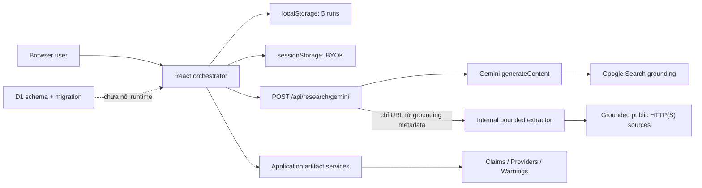

# System Design

## 1. Kiến trúc đang chạy



Gateway cùng origin nhận BYOK cho từng request, validate body/prompt/token/schema rồi forward sang Gemini. Với Scout search response thành công, chính gateway extract toàn bộ URL duy nhất từ grounding metadata theo concurrency 4; application use case sau đó chọn tối đa 8 nguồn cho research packet. Không còn API đọc URL tùy ý từ browser. Gateway không phải secret vault: key vẫn bắt đầu ở browser và đi qua gateway process.

## 2. Pipeline live

```mermaid
sequenceDiagram
    participant O as Browser Orchestrator
    participant G as Gemini Gateway
    participant E as Source Extractor

    par Balanced search and grounded extraction
      O->>G: Balanced Scout + google_search
      G->>E: All unique grounding URLs from this response
      E-->>G: Bounded direct extractions
      G-->>O: Text + citations + sourceExtractions
    and Counter search and grounded extraction
      O->>G: Counter-evidence Scout + google_search
      G->>E: All unique grounding URLs from this response
      E-->>G: Bounded direct extractions
      G-->>O: Text + citations + sourceExtractions
    end
    O->>O: Dedupe + xen kẽ hai Scout, cap 8 cho analysis
    O->>O: Evidence passages direct/grounding + Provider Registry + source families
    par Analysis and bounded provider verification
      O->>G: Perspective Analyst + evidence packet
    and
      O->>G: Provider Verification + assigned providers + google_search
    end
    G-->>O: Grounded provider report, hoặc fallback unknown
    O->>G: Source Warning Auditor + provider report + JSON schema, no search
    O->>O: Map citation theo provider; verify warning quote ≥20 chars
    O->>O: Parse Perspective JSON và sinh Markdown ổn định
    O->>G: Evidence Judge · Claim Ledger + JSON schema, no search
    O->>O: Exact quote match ≥20 + support/contradiction invariant + provenance
    O->>G: Evidence Judge · Report + validated Claim Ledger, no search
```

## 3. Layer responsibilities

| Layer | Thành phần | Trách nhiệm |
|---|---|---|
| Domain | `domain/research/*` | Immutable contracts, factories và invariant cho source/evidence/claim/warning |
| Application | `run-live-research.ts` | Live use case; điều phối 7 loại operation qua ports, cân bằng nguồn, family/provider/audit/Judge và completion logs |
| Application | `pipeline-artifacts.ts` | Evidence passages, parse Perspective, map provider citations, downgrade audit và kiểm tra invariant của Judge claims |
| Application | `source-intelligence.ts` | URL canonicalization, source families và citation completeness |
| Infrastructure | `source/extraction.ts` | Bounded fetch, redirect validation, readable-text extraction |
| Infrastructure | `gemini/request.ts` | Validate gateway request và token bounds |
| Delivery | Gemini API route | Same-origin proxy, retry/bounds và extraction chỉ từ grounded URLs |
| Presentation | `page.tsx`, components | Port adapters, local state/history và artifact rendering |
| Persistence | `db/schema.ts`, migration | Schema sẵn có nhưng chưa có repository/use case ghi D1 |

## 4. Source-family semantics

Pure service tạo heuristic cluster khi có ít nhất một quan hệ sau:

- canonical URL giống nhau;
- `contentFingerprint` giống hệt;
- `upstreamSourceIds` chỉ rõ quan hệ.

Live runtime đưa tối đa 3.000 ký tự mỗi nguồn vào evidence packet, tạo fingerprint từ 1.200 ký tự đầu của excerpt sau normalize và chưa trích/populate upstream ID. Vì vậy cluster chỉ là chỉ báo sơ bộ, chưa phải provenance graph, semantic similarity, wire-copy hay ownership detection.

Evidence packet là một JSON object được `JSON.stringify` và đặt trong `<UNTRUSTED_SOURCE_DATA_JSON>`. Mỗi nguồn có thể chứa cả passage đọc trực tiếp và passage grounding-support, với locator/provenance riêng. Cách này giữ source text ở trường dữ liệu thay vì ghép delimiter tự do, nhưng không tự loại bỏ indirect prompt injection.

## 5. Failure behavior

- Hai Scout chạy song song. Perspective Analyst chạy song song với các Provider Verification; các lô structured Source Auditor chạy sau khi verification hoàn tất. Một request bắt buộc lỗi sau retry làm run dừng, riêng Provider Verification lỗi được hạ về dữ liệu không đủ thay vì dừng run.
- Mỗi source extraction có fallback `inaccessible`, nên một nguồn không đọc được không tự làm mất cả run.
- Không grounding URL: dừng, không tạo báo cáo giả.
- Gateway retry 429/5xx tối đa 3 attempt với exponential delay + jitter; mỗi Gemini attempt timeout 30 giây.
- Gateway giới hạn request body theo `Content-Length` 80 KB, prompt 50.000 ký tự, response schema 20.000 ký tự và output 200–3.000 tokens.
- Chưa streaming, cancel toàn use case hoặc partial-result policy. Extractor có AbortController nội bộ cho timeout từng source fetch.
- Storage lỗi bị bỏ qua; D1 chưa tham gia runtime.

## 6. Giới hạn truy nguyên

Judge phải trả `evidenceLinks` có quan hệ `supports`, `contradicts` hoặc `context`. Parser chỉ tạo citation khi quote dài tối thiểu 20 ký tự và là exact substring không phân biệt hoa thường trong một evidence passage tương ứng; locator thêm character offset và provenance. Parser kiểm tra quan hệ tối thiểu theo verdict và giới hạn confidence khi chỉ có grounding-support. Điều này mạnh hơn chỉ kiểm tra source index, nhưng character offset thuộc passage chứ không phải vị trí bền vững trong tài liệu gốc và chưa kiểm định semantic entailment/context omission.
