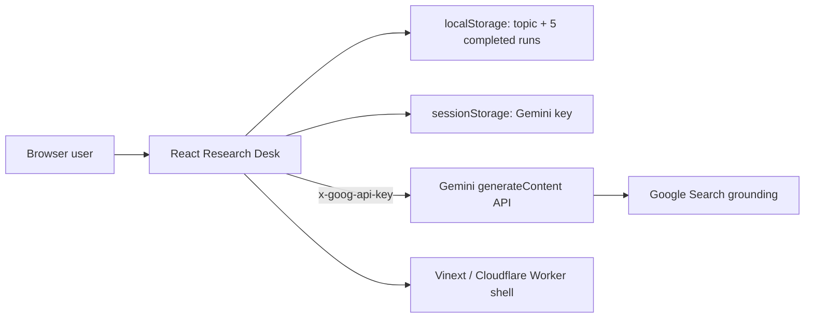
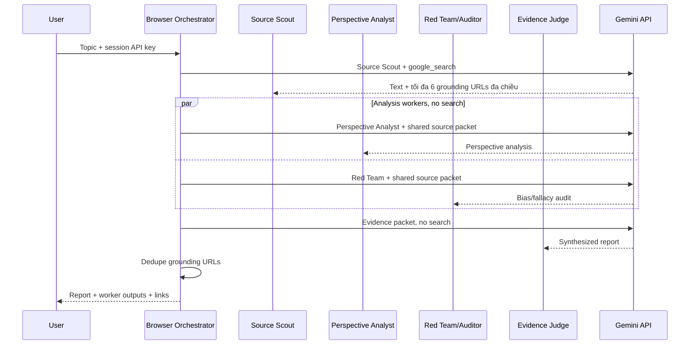

# System Design

## 1. Kiến trúc hiện tại



Ứng dụng là client-heavy. Worker phục vụ app và image optimization; Gemini call không đi qua Worker.

## 2. Live-only execution



## 3. Runtime components

| Component | Trách nhiệm hiện tại |
|---|---|
| `Home` | Toàn bộ application state và rendering |
| `callGemini` | HTTP request, response parsing và grounding extraction |
| `runGeminiResearch` | Source Scout tìm 6 nguồn, fan-out Perspective và Source Bias Auditor, fan-in Judge |
| `parseBiasAudit` | Validate JSON bias audit, chỉ nhận URL thuộc grounding packet và bổ sung trạng thái chưa đủ dữ kiện |
| `Meter` | Progress/confidence primitive |
| `worker/index.ts` | Vinext routing và image optimization |
| `layout.tsx` | Metadata theo incoming host |

## 4. State model

```text
topic, activeTopic
status: idle | running | complete
phase: -1..6
tab: report | sources | log
apiKey, keyDraft, settingsOpen
geminiResult, geminiError
logs
history: tối đa 5 ResearchHistoryItem
historyReady: chặn ghi trước khi hydrate xong
```

Live request hiện không có `AbortController` hoặc cancel.

## 5. Target modular architecture

```text
app/
  page.tsx
components/
  research-composer.tsx
  pipeline-rail.tsx
  result-tabs.tsx
  source-explorer.tsx
  claim-ledger.tsx
  evidence-inspector.tsx
  gemini-key-dialog.tsx
lib/
  gemini/client.ts
  gemini/prompts.ts
  research/orchestrator.ts
  research/models.ts
  storage/session.ts
```

Khi chuyển sang production, Gemini client nên nằm server-side hoặc trong một gateway riêng, có rate limiting, audit log và secret isolation.

## 6. Failure behavior hiện tại

- HTTP không thành công: đọc `error.message` từ Gemini.
- JSON lỗi: fallback object rỗng.
- Response không có text: hiển thị lỗi safety/topic.
- Một worker lỗi: `Promise.all` làm toàn run thất bại.
- Grounding không có URL: dừng phiên và không tạo báo cáo fallback.
- Storage hỏng/quota: bỏ qua và tiếp tục.

## 7. Các quyết định kiến trúc

- Fan-out hai worker phân tích trên cùng source packet để giảm chi phí và vẫn giữ kiểm định đối kháng.
- Judge không search lại để chỉ phân xử evidence packet đã thu thập.
- Grounding links lấy từ metadata thay vì tin URL do model viết trong text.
- Source Bias Auditor dùng structured JSON, không search thêm; bias note chỉ được gắn vào URL đã có trong grounding metadata.
- Không có fallback source/claim: thiếu key hoặc API lỗi dẫn đến empty/error state.
- Markdown được render bằng `react-markdown` + GFM; HTML thô bị bỏ qua.
- Phiên hoàn tất được validate, cắt còn năm record và lưu client-side; API key vẫn chỉ ở `sessionStorage`.
